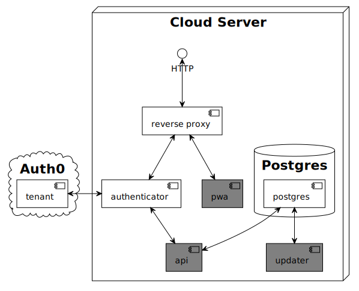

# Podcast Player

A simple offline-first app for listening to podcasts.

## Components

Since podcast feeds can - in general - not be accessed directly from a web application, a backend component was implemented.
Hence, there are three parts to the system:
* the web application (pwa)
* the backend (api)
* an update process (updater)

## License

This work is licensed under the MIT license.

`SPDX-License-Identifier: MIT`
